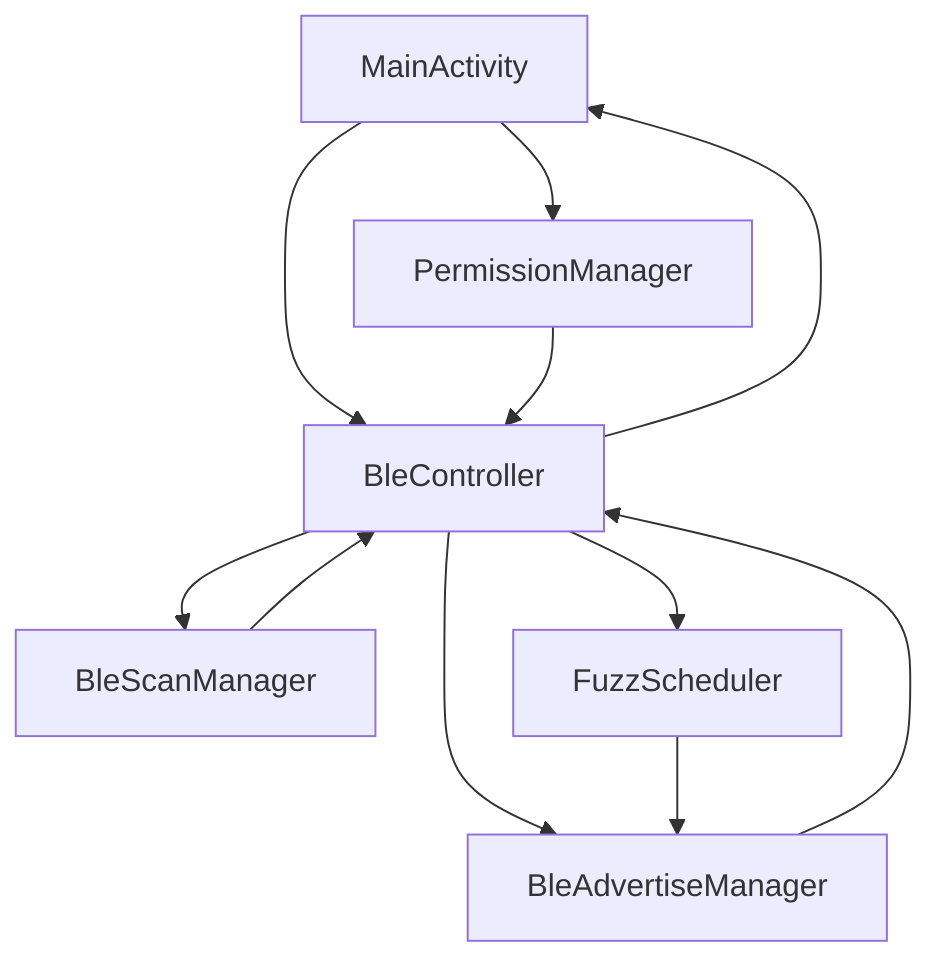

# Architecture Refactor Plan

## Overview

This document proposes a refactoring of the AxonCadabra app to separate BLE concerns from UI, improve testability, and enhance code maintainability.

## Current Architecture

**Single Activity Pattern:**
- All logic in `MainActivity.kt` (476 lines)
- BLE operations, UI updates, and data models tightly coupled
- Difficult to test, maintain, and extend

## Proposed Architecture

### Component Structure

```
com.axon.blecontroller/
├── MainActivity.kt                    # UI only, delegates to BleController
├── ble/
│   ├── BleController.kt              # Main BLE coordinator
│   ├── BleScanManager.kt             # Scanning operations
│   ├── BleAdvertiseManager.kt        # Advertising operations
│   ├── FuzzScheduler.kt              # Fuzz loop management
│   └── BleState.kt                    # BLE state data classes
├── data/
│   └── BleDevice.kt                   # Device data model (extracted)
├── ui/
│   ├── DeviceAdapter.kt              # RecyclerView adapter (extracted)
│   └── BleStatusViewModel.kt         # Optional: ViewModel for state
└── permissions/
    └── PermissionManager.kt          # Permission handling
```

### Component Responsibilities

#### 1. BleController.kt
**Purpose:** Main coordinator for all BLE operations

**Responsibilities:**
- Initialize Bluetooth adapter and managers
- Coordinate between scan and advertise managers
- Manage overall BLE state
- Provide callbacks for UI updates

**Interface:**
```kotlin
class BleController(private val context: Context) {
    interface Listener {
        fun onScanStateChanged(isScanning: Boolean)
        fun onDeviceFound(device: BleDevice)
        fun onDeviceUpdated(device: BleDevice)
        fun onAdvertiseStateChanged(isAdvertising: Boolean)
        fun onError(error: BleError)
    }
    
    fun startScanning()
    fun stopScanning()
    fun startAdvertising()
    fun stopAdvertising()
    fun startFuzzing(mode: FuzzMode)
    fun stopFuzzing()
    fun isScanning(): Boolean
    fun isAdvertising(): Boolean
    fun isFuzzing(): Boolean
}
```

#### 2. BleScanManager.kt
**Purpose:** Handle all BLE scanning operations

**Responsibilities:**
- Configure scan settings and filters
- Manage scan callbacks
- Filter results by OUI
- Handle scan errors and retries

**Key Features:**
- Uses `ScanFilter` for service UUID `0xFE6C`
- Thread-safe device list updates
- Error recovery with exponential backoff

#### 3. BleAdvertiseManager.kt
**Purpose:** Handle all BLE advertising operations

**Responsibilities:**
- Configure advertise settings and data
- Manage advertise callbacks
- Validate payload size
- Handle advertise errors and retries

**Key Features:**
- Payload size validation
- Error recovery
- State management

#### 4. FuzzScheduler.kt
**Purpose:** Manage fuzz loop execution

**Responsibilities:**
- Schedule fuzz iterations
- Generate fuzz values (sequential or random)
- Coordinate with advertise manager
- Handle lifecycle safety

**Key Features:**
- Lifecycle-safe (uses WeakReference)
- Supports sequential and random modes
- Configurable intervals and limits
- Automatic stop on errors

#### 5. PermissionManager.kt
**Purpose:** Centralized permission handling

**Responsibilities:**
- Check required permissions
- Request permissions
- Handle permission results
- Check Bluetooth adapter state

**Key Features:**
- SDK version-aware permission lists
- Bluetooth enable prompt
- Adapter state monitoring

### Data Flow



### State Management

**BleState.kt:**
```kotlin
data class BleState(
    val isScanning: Boolean = false,
    val isAdvertising: Boolean = false,
    val isFuzzing: Boolean = false,
    val fuzzMode: FuzzMode = FuzzMode.SEQUENTIAL,
    val fuzzValue: Int = 0,
    val foundDevices: List<BleDevice> = emptyList(),
    val error: BleError? = null
)

enum class FuzzMode {
    SEQUENTIAL,
    RANDOM
}

sealed class BleError {
    object BluetoothDisabled : BleError()
    object AdapterUnavailable : BleError()
    object PermissionDenied : BleError()
    data class ScanFailed(val code: Int) : BleError()
    data class AdvertiseFailed(val code: Int) : BleError()
}
```

### Lifecycle Safety

**Key Principles:**
1. Use `WeakReference` for callbacks to prevent memory leaks
2. Check `isFinishing` before UI updates
3. Proper cleanup in `onDestroy()`
4. Thread-safe state updates

**Example (FuzzScheduler):**
```kotlin
class FuzzScheduler(
    private val advertiseManager: BleAdvertiseManager,
    private val listener: WeakReference<BleController.Listener>
) {
    private val handler = Handler(Looper.getMainLooper())
    private var runnable: Runnable? = null
    
    fun start(mode: FuzzMode) {
        runnable = object : Runnable {
            override fun run() {
                listener.get()?.let { listener ->
                    // Update fuzz value
                    // Restart advertising
                    handler.postDelayed(this, interval)
                } ?: run {
                    // Listener gone, stop
                    stop()
                }
            }
        }
        handler.post(runnable!!)
    }
}
```

### Testing Strategy

**Unit Tests:**
- `BleScanManager`: Mock `BluetoothLeScanner`, test filtering logic
- `BleAdvertiseManager`: Mock `BluetoothLeAdvertiser`, test payload validation
- `FuzzScheduler`: Test fuzz value generation, lifecycle safety
- `PermissionManager`: Test permission checks, Bluetooth state

**Integration Tests:**
- `BleController`: Test coordination between managers
- End-to-end: Test full scan/advertise/fuzz flow

**Benefits:**
- ✅ Testable without Android framework
- ✅ Mockable dependencies
- ✅ Isolated component testing

### Migration Strategy

**Phase 1: Extract Data Models**
1. Extract `BleDevice` to separate file
2. Extract `DeviceAdapter` to separate file
3. No functional changes

**Phase 2: Extract Permission Logic**
1. Create `PermissionManager`
2. Move permission logic from `MainActivity`
3. Update `MainActivity` to use `PermissionManager`

**Phase 3: Extract BLE Managers**
1. Create `BleScanManager`
2. Create `BleAdvertiseManager`
3. Move scan/advertise logic from `MainActivity`
4. Update `MainActivity` to use managers

**Phase 4: Create BleController**
1. Create `BleController` as coordinator
2. Integrate managers into controller
3. Update `MainActivity` to use controller

**Phase 5: Extract Fuzz Logic**
1. Create `FuzzScheduler`
2. Move fuzz logic from `MainActivity`
3. Integrate with `BleController`

**Phase 6: Cleanup**
1. Remove unused code from `MainActivity`
2. Add documentation
3. Add unit tests

### Benefits

1. **Testability:** Each component can be tested independently
2. **Maintainability:** Clear separation of concerns
3. **Reusability:** BLE logic can be reused in other components
4. **Readability:** Smaller, focused classes
5. **Extensibility:** Easy to add new features (e.g., BLE connection)

### Risks & Mitigations

**Risk:** Breaking changes during refactor
**Mitigation:** Incremental migration, test after each phase

**Risk:** Increased complexity
**Mitigation:** Clear documentation, simple interfaces

**Risk:** Performance overhead
**Mitigation:** Minimal overhead, delegate pattern is lightweight

---

**End of Architecture Refactor Plan**
