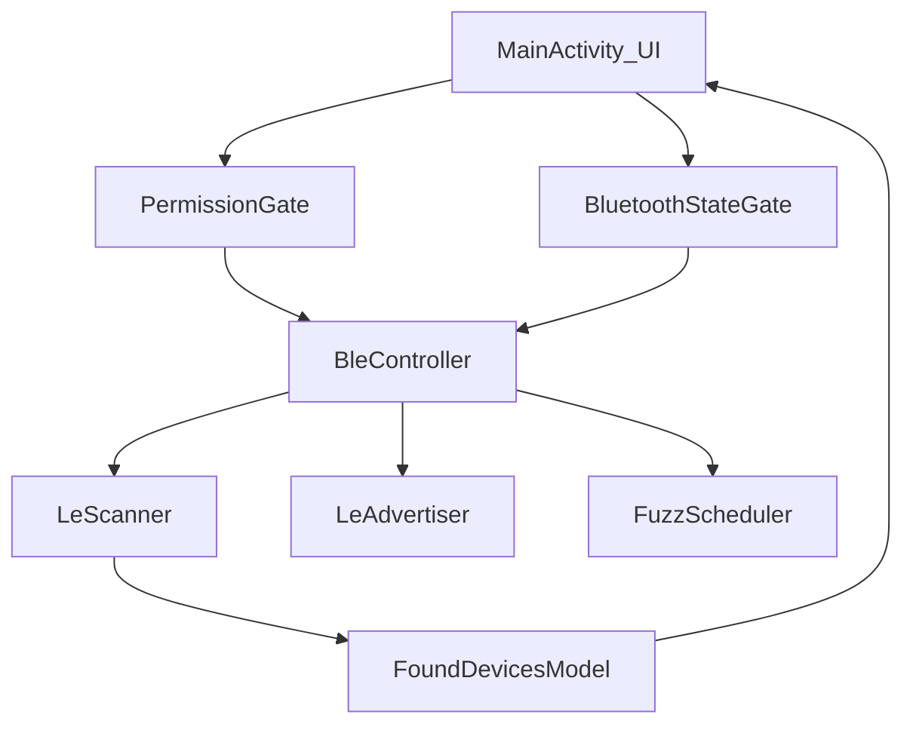

### Goals

- Produce **(1) a written analysis report** and **(2) an implementation plan** focused on **security/privacy**, **BLE correctness**, **stability/performance**, and **architecture/code quality**.
- Target **Android API 26–34**.
- Respect your preferences: **keep current permissions for reliability**, **disable Android backup**, **minimize logs everywhere**, **prompt to enable Bluetooth**, **use `ScanFilter` when possible**, **keep connectable advertising**, and **support both sequential and randomized fuzz modes**.

### What I've found so far (current shape)

- The app logic is concentrated in a single activity: [`app/src/main/java/com/axon/blecontroller/MainActivity.kt`](/projects/vibe_/AxonCadabra/app/src/main/java/com/axon/blecontroller/MainActivity.kt).
  - Scanning: `startScan(null, scanSettings, scanCallback)` then filters by MAC prefix `TARGET_OUI = "00:25:DF"`.
  - Advertising: broadcasts service data under UUID `0000FE6C-0000-1000-8000-00805F9B34FB` and optionally "fuzzes" bytes by repeatedly stopping/starting advertising every 500ms.
- Manifest currently sets `android:allowBackup="true"` and exports only the launcher activity: [`app/src/main/AndroidManifest.xml`](/projects/vibe_/AxonCadabra/app/src/main/AndroidManifest.xml).

### Analysis approach (how I'll structure the report)

- **Entry points & permissions**
  - Review [`app/src/main/AndroidManifest.xml`](/projects/vibe_/AxonCadabra/app/src/main/AndroidManifest.xml) and runtime permission gating in `MainActivity`.
  - Map expected behavior when permissions are denied, Bluetooth is off, BLE advertiser is unavailable, and on lifecycle transitions.
- **BLE scan path**
  - Recommend adding a `ScanFilter` based on the most reliable available discriminator (likely service UUID `0xFE6C`), while retaining the OUI check as a secondary filter.
  - Evaluate power/perf implications of `SCAN_MODE_LOW_LATENCY` and unfiltered scans.
- **BLE advertise path**
  - Validate advertising payload sizing for service-data and scan response across devices.
  - Evaluate stability of repeated stop/start at 500ms (vendor stacks can be sensitive), and propose guardrails/backoff.
- **Fuzz mode**
  - Specify sequential + randomized fuzz behaviors and how to switch modes in the UI.
  - Ensure fuzz loop is lifecycle-safe and doesn't thrash the advertiser unnecessarily.
- **Security/privacy**
  - Propose `allowBackup=false` and a logging strategy consistent with "minimize logs everywhere".
  - Ensure no sensitive identifiers (MACs, payload bytes) are exposed unnecessarily.
- **Architecture**
  - Propose extraction of BLE operations from `MainActivity` into a focused component (e.g., `BleController`), with a small state model and clean UI bindings.

### Proposed high-level flow (current → refactored target)

### Files likely touched (once you approve execution later)

- [`app/src/main/java/com/axon/blecontroller/MainActivity.kt`](/projects/vibe_/AxonCadabra/app/src/main/java/com/axon/blecontroller/MainActivity.kt)
- [`app/src/main/AndroidManifest.xml`](/projects/vibe_/AxonCadabra/app/src/main/AndroidManifest.xml)
- Potentially new files under [`app/src/main/java/com/axon/blecontroller/`](/projects/vibe_/AxonCadabra/app/src/main/java/com/axon/blecontroller/) for extracted BLE/controller logic (only after you approve execution).

### Verification checklist (for the implementation plan)

- On API 26–30: scan works with location permission; advertise works where supported; denial states are handled.
- On API 31–34: scan/advertise/connect permissions are requested and enforced correctly.
- Bluetooth OFF: user gets a prompt to enable; app doesn't crash.
- Advertiser unsupported: app degrades gracefully; fuzz doesn't start.
- Fuzz sequential/random: start/stop is stable; no runaway handler callbacks after lifecycle events.
- Logs: no MAC/payload dumps in normal operation (per your preference).
